# Wanderly

A collaborative trip-planning app: build a day-by-day itinerary — either by browsing real places or by asking an AI assistant — split group expenses with an automatic debt-settling algorithm, sync everything to a shared calendar with live weather, and generate a packing list tailored to the trip.

🔗 **Live demo:** https://wanderly-rzuo.onrender.com

---

## How to Run

**Prerequisites:** Node.js, a MongoDB Atlas connection string, an Anthropic API key, and a Google Places API key.

1. Install dependencies:
   ```bash
   npm install
   ```

2. Create a `.env` file in the project root:
   ```
   MONGO_URI=your_mongodb_connection_string
   SESSION_SECRET=your_session_secret
   PORT=3000
   GOOGLE_PLACES_API=your_google_places_api_key
   ANTHROPIC_API_KEY=your_anthropic_api_key
   ```

3. Start the server:
   ```bash
   node server.js
   ```

4. Open your browser and go to `http://localhost:3000`

There's no build step, bundler, or test suite — it's a plain Express server serving static HTML/CSS/JS, connected to a real MongoDB Atlas cluster (no local/test database).

---

## Pages

### Login / Sign up (`index.html`)

Auth landing page — log in or create an account. Client-side validation with inline errors, specific backend error messages on failure. Opening a trip invite link while logged out drops you here first, then joins you to that trip automatically once you sign in.

| Desktop | Mobile |
|---|---|
| 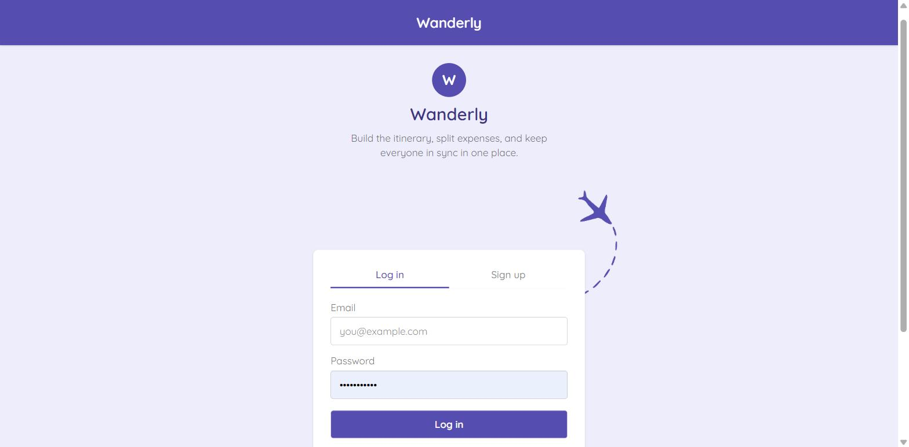 | 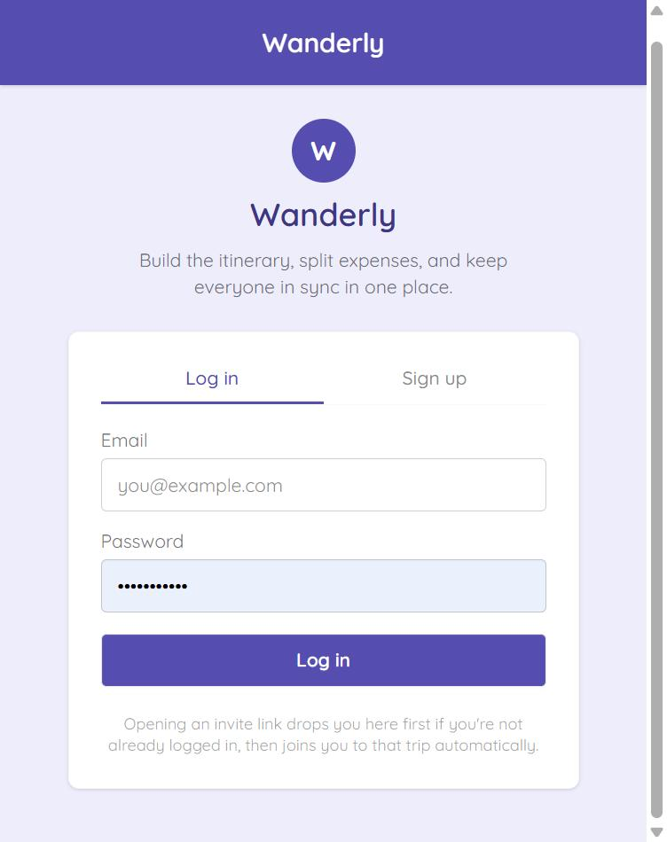 |

---

### Plan (`plan.html`)

The trip-planning hub, with two modes for finding things to do:

**Suggestions mode** — search attractions, restaurants, or activities and get real results from the Google Places API (ratings, review counts, price level, opening hours, photos), with filter pills (category, price, "Most Popular") and a "Load More" pagination flow. Every card can be added straight to the calendar, for yourself or the whole group.

**Ask AI mode** — chat with Claude about the trip. It can research and suggest places (grounded in real search, not guesses), check the weather, build a full day-by-day itinerary from a short preference form (budget, interests, pace, transportation), add/edit/delete calendar activities directly, and generate a packing list — all through natural conversation, with the results rendered as the same interactive cards Suggestions mode uses.

The sidebar (shared across every tab) lists all your trips, lets you create/edit/delete a trip, and shows a live feed of recently added activities.

| Desktop | Mobile |
|---|---|
| 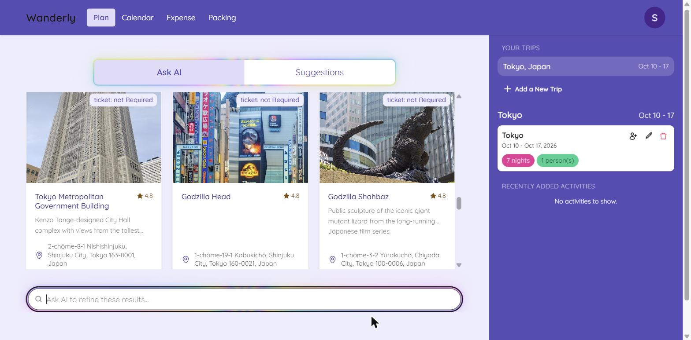 | 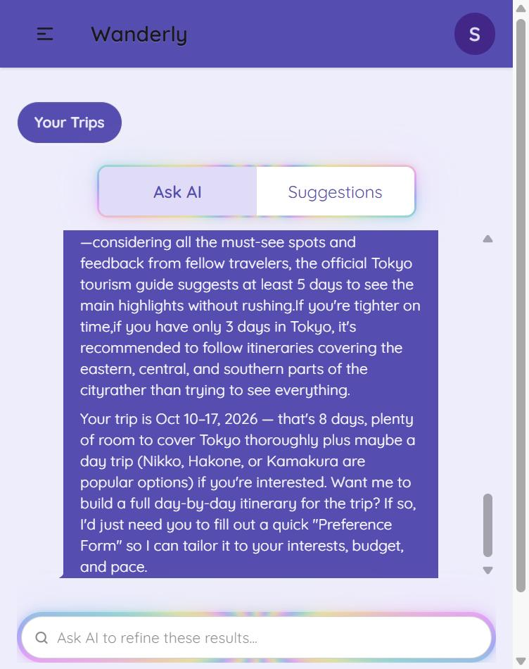 |

| Suggestions (desktop) | Suggestions (mobile) |
|---|---|
| 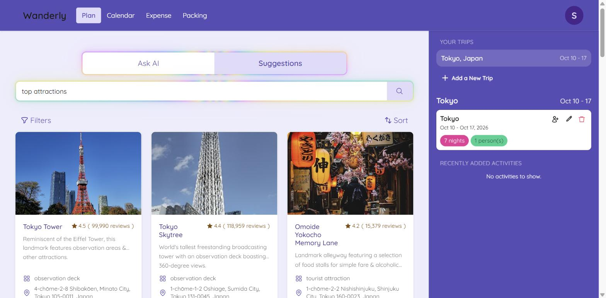 | 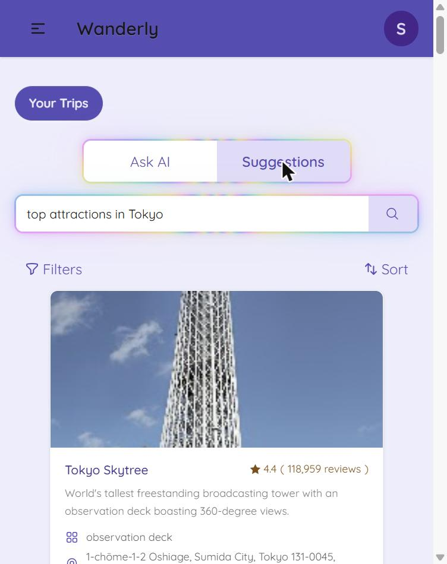 |

The "Plan My Trip" preference form Claude opens for a full-itinerary request:

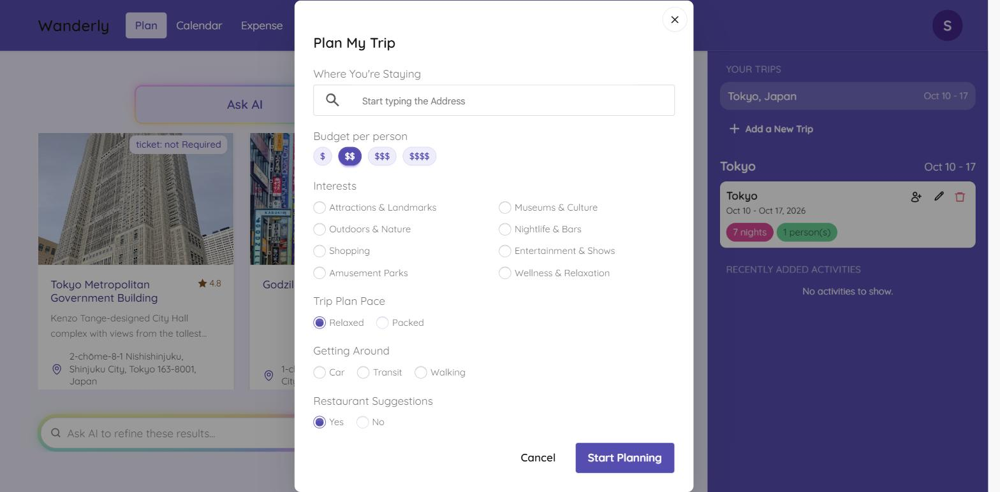

**Inviting people:** any trip member can generate a shareable join link from the sidebar's invite icon. Opening it while logged out drops the recipient into a combined login/sign-up form, then straight into a "You're invited" confirmation screen naming the trip and who invited them — accepting adds them to the trip immediately, no separate approval step from the inviter. Real accounts created this way show up everywhere alongside the trip owner, with no distinction from the person who created the trip.

| Sharing the invite link | What the invitee sees |
|---|---|
| 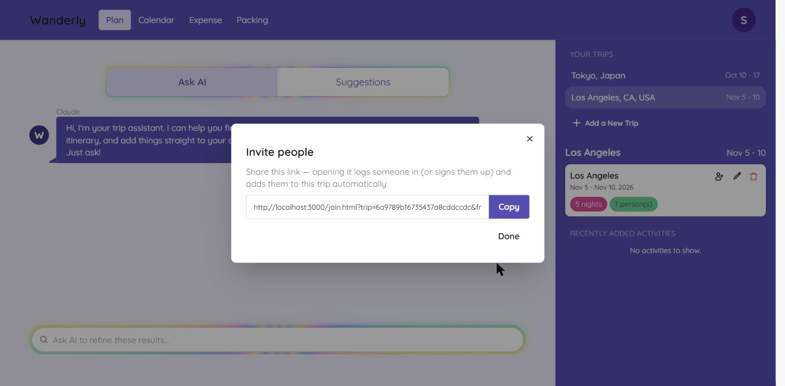 | 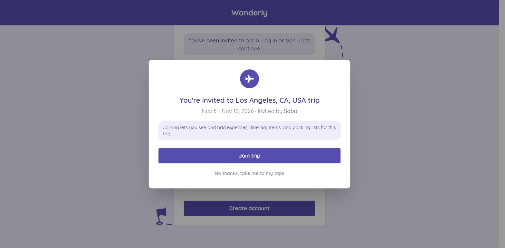 |

---

### Calendar (`calendar.html`)

Every trip activity on a real calendar (month / day / list views), plus a 10-day weather forecast for the destination with a "heads-up" banner that cross-references rain chance against what's actually scheduled that day.

**Features:**
- Add, edit, and delete events directly on the calendar (own schedule or group schedule)
- Drag-to-reschedule and resize-to-change-duration, with a confirm step before saving
- Activities Claude added on its own show an emerald "(By Claude)" label
- Each event links out to its location on a map
- Mobile hints for the touch equivalents of drag/resize (tap, press-and-hold, drag-the-edge)

Day view for the Los Angeles trip, showing a real 10-day forecast and a Griffith Observatory visit Claude added to the group's shared calendar:

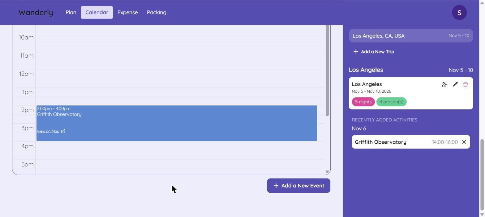

The Weather section on mobile — current conditions plus the 10-day forecast, stacked single-column:

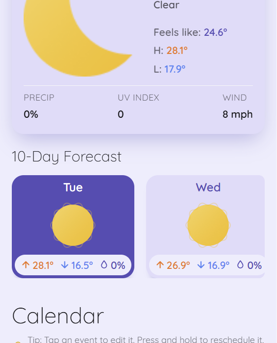

---

### Expense (`expense.html`)

Splits shared trip costs and works out the simplest way for everyone to settle up.

**Features:**
- Add an expense, split equally or with a custom breakdown, among any subset of the group
- "Total Spent Per Person" cards and a full debt breakdown, filterable by person
- A minimum-payments settle-up view (who pays whom, and how much) instead of a full pairwise ledger
- "Guest members" — track expenses for someone without an account (no email/password needed), marked with a ghost icon everywhere their name appears
- Only the debtor themselves can mark their own real debt as settled; guest members can be settled by any trip member

The screenshot below mixes both kinds of trip members on purpose: Saba, Sina, and Soroush are real invited accounts (see "Inviting people" in the Plan section above), while Hassan is a guest member with no account at all. Three expenses (Airbnb, rental car, dinner) paid by different real members are collapsed by "Simplest Way to Settle" into the minimum number of payments needed to zero everyone out — including Hassan's guest debt, settled the same way a real member's would be:

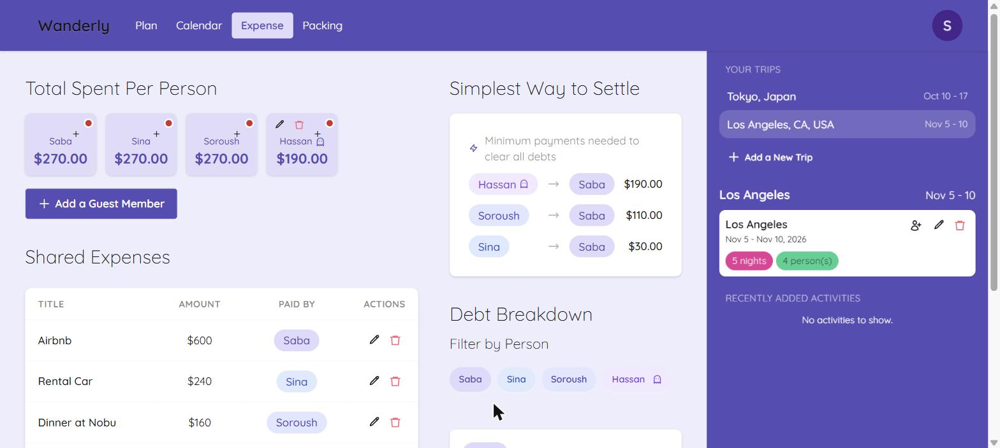

---

### Packing (`packing.html`)

A per-person, per-trip packing checklist.

**Features:**
- "Generate my packing list" hands the trip off to Claude, which checks the weather forecast and the real itinerary before drafting categorized items (Documents & Essentials, Weather Essentials, Planned Activities, Toiletries & Health)
- Per-item checkboxes with a live progress bar, plus manually adding your own items
- Generated state persists in the database (not just localStorage), so it survives reloads and trip switches

| Desktop | Mobile |
|---|---|
| 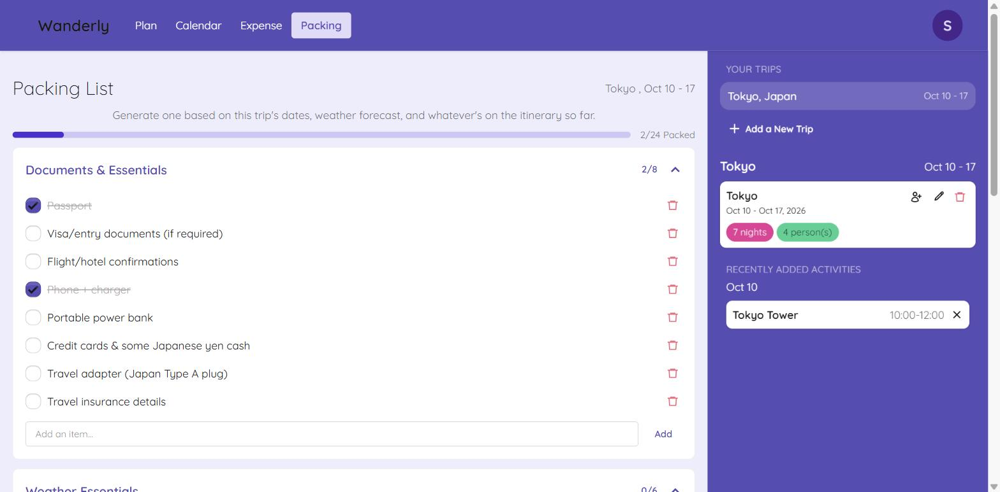 | 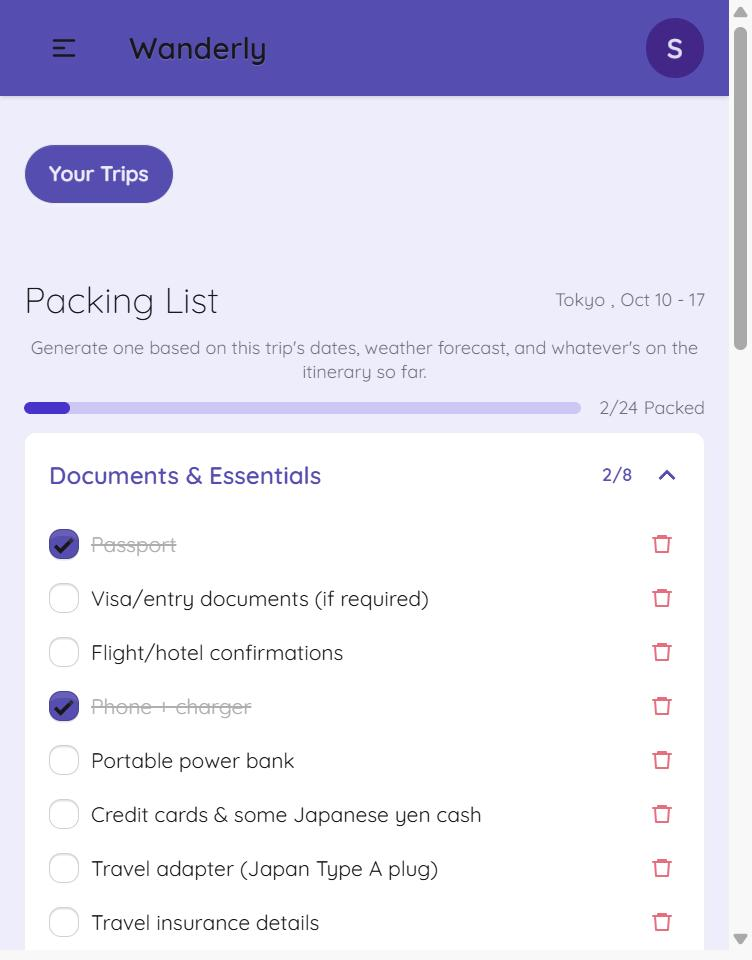 |

---

### Account / Settings (`account.html`, `settings.html`)

Edit your name/email, change your password, or delete your account (which also removes you from every trip you're part of). The navbar avatar shows your initials, colored consistently across the app.

| Desktop | Mobile |
|---|---|
| 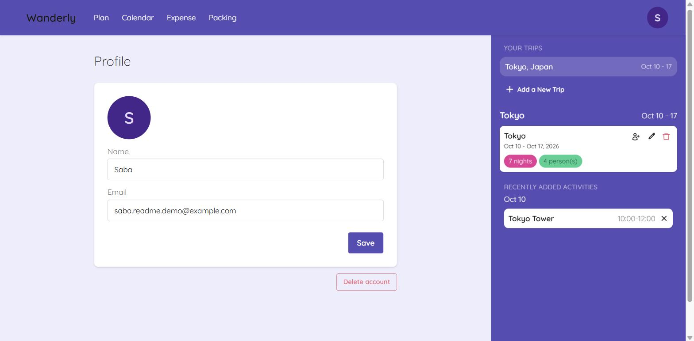 | 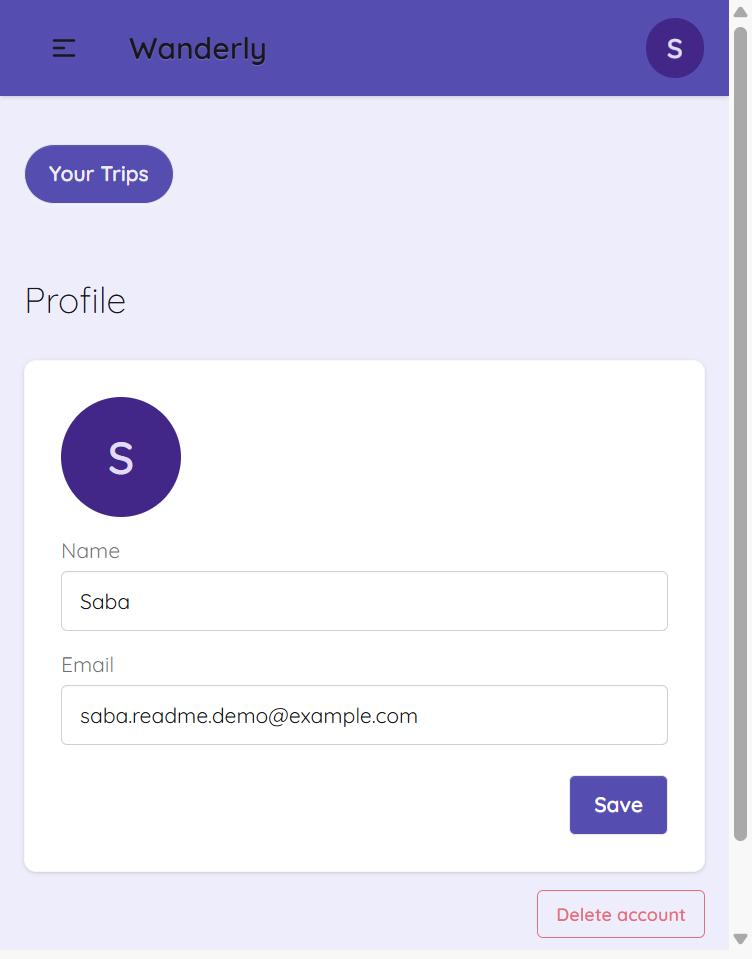 |

---

## Tech Stack

| Layer | Technologies |
|---|---|
| Frontend | HTML, Tailwind CSS + daisyUI (via CDN) |
| Backend | Node.js, Express, express-session (`connect-mongo` store) |
| Database | MongoDB Atlas via Mongoose |
| AI | Anthropic Claude (`@anthropic-ai/sdk`) — tool-calling loop with a custom toolset (search places, weather, calendar CRUD, packing list) plus Claude's built-in web search |
| APIs | Google Places API (destination autocomplete, suggestions, photos), Google Weather API (forecast + current conditions), Claude API |
| Calendar | FullCalendar |
| Auth | bcrypt password hashing, session-based auth |
